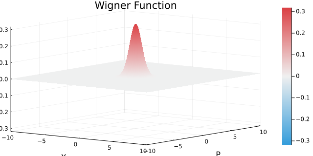
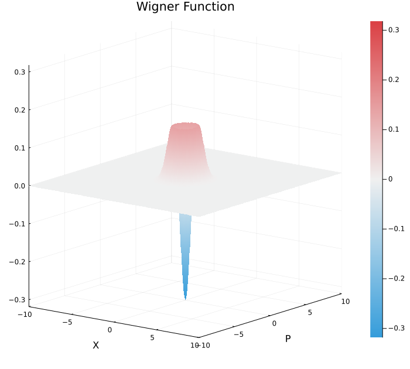
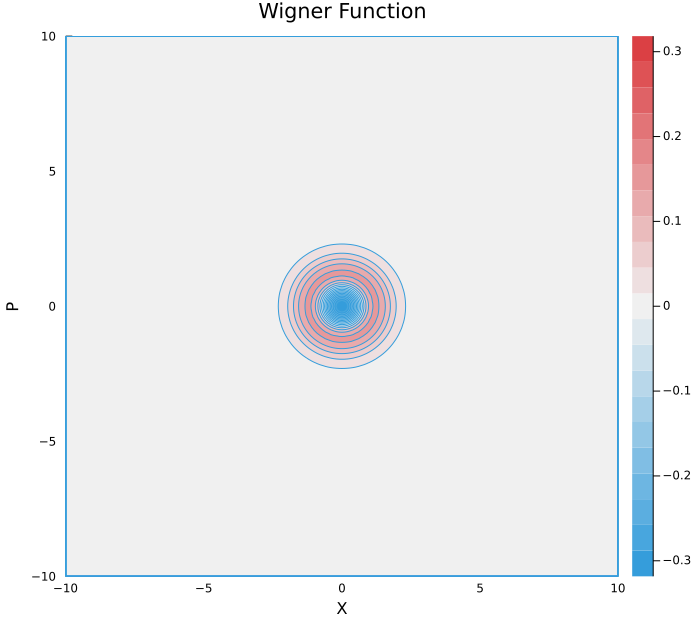

# SqState

Squeezed state solver for quantum optics.


[](https://codecov.io/gh/foldfelis/SqState.jl)


[](https://github.com/invenia/BlueStyle)




## State

### Fock state

The following example shows how to construct Fock states.

```julia
julia> FockState(0)
(1.0 + 0.0im)|0⟩

julia> FockState(1)
(1.0 + 0.0im)|1⟩

julia> FockState(2)
(1.0 + 0.0im)|2⟩
```

The alias are also acceptable.

```julia
julia> VacuumState()
(1.0 + 0.0im)|0⟩

julia> SinglePhotonState()
(1.0 + 0.0im)|1⟩

julia> NumberState(2)
(1.0 + 0.0im)|2⟩
```

The Fock state can be also constructed by applying `create` operator to vacuum state, or by applying `annihilate` operator to `FockState(n)`.

```julia
julia> state = VacuumState()
(1.0 + 0.0im)|0⟩

julia> create(state)
(1.0 + 0.0im)|1⟩

julia> create(create(state))
(1.4142135623730951 + 0.0im)|2⟩

julia> create(create(create(state)))
(2.4494897427831783 + 0.0im)|3⟩
```

```julia
julia> state = FockState(5)
(1.0 + 0.0im)|5⟩

julia> annihilate(state)
(2.23606797749979 + 0.0im)|4⟩

julia> annihilate(annihilate(state))
(4.47213595499958 + 0.0im)|3⟩

julia> annihilate(annihilate(annihilate(state)))
(7.745966692414834 + 0.0im)|2⟩
```

Or simply use `createⁿ` operator and `annihilateⁿ` operator.

```julia
julia> createⁿ(VacuumState(), 3)
(2.4494897427831783 + 0.0im)|3⟩

julia> annihilateⁿ(FockState(5), 3)
(7.745966692414834 + 0.0im)|2⟩
```

State vector of Fock state

```julia
julia> vec(VacuumState())
35-element Vector{Complex}:
 1.0 + 0.0im
   0 + 0im
   0 + 0im
   0 + 0im
     ⋮
   0 + 0im
   0 + 0im

julia> vec(SinglePhotonState())
35-element Vector{Complex}:
   0 + 0im
 1.0 + 0.0im
   0 + 0im
   0 + 0im
     ⋮
   0 + 0im
   0 + 0im

   julia> vec(FockState(3))
35-element Vector{Complex}:
   0 + 0im
   0 + 0im
   0 + 0im
 1.0 + 0.0im
     ⋮
   0 + 0im
   0 + 0im
   0 + 0im
```

Density matrix of Fock state

```julia
julia> ρ(VacuumState())
35×35 Matrix{Complex}:
 1.0+0.0im  0+0im  0+0im  0+0im  …  0+0im  0+0im  0+0im  0+0im  0+0im
   0+0im    0+0im  0+0im  0+0im     0+0im  0+0im  0+0im  0+0im  0+0im
   0+0im    0+0im  0+0im  0+0im     0+0im  0+0im  0+0im  0+0im  0+0im
   0+0im    0+0im  0+0im  0+0im     0+0im  0+0im  0+0im  0+0im  0+0im
    ⋮                            ⋱   ⋮
   0+0im    0+0im  0+0im  0+0im     0+0im  0+0im  0+0im  0+0im  0+0im
   0+0im    0+0im  0+0im  0+0im     0+0im  0+0im  0+0im  0+0im  0+0im

julia> ρ(SinglePhotonState())
35×35 Matrix{Complex}:
 0+0im    0+0im    0+0im  0+0im  …  0+0im  0+0im  0+0im  0+0im  0+0im
 0+0im  1.0+0.0im  0+0im  0+0im     0+0im  0+0im  0+0im  0+0im  0+0im
 0+0im    0+0im    0+0im  0+0im     0+0im  0+0im  0+0im  0+0im  0+0im
 0+0im    0+0im    0+0im  0+0im     0+0im  0+0im  0+0im  0+0im  0+0im
  ⋮                              ⋱   ⋮
 0+0im    0+0im    0+0im  0+0im     0+0im  0+0im  0+0im  0+0im  0+0im
 0+0im    0+0im    0+0im  0+0im     0+0im  0+0im  0+0im  0+0im  0+0im

julia> ρ(FockState(3))
35×35 Matrix{Complex}:
 0+0im  0+0im  0+0im    0+0im    …  0+0im  0+0im  0+0im  0+0im  0+0im
 0+0im  0+0im  0+0im    0+0im       0+0im  0+0im  0+0im  0+0im  0+0im
 0+0im  0+0im  0+0im    0+0im       0+0im  0+0im  0+0im  0+0im  0+0im
 0+0im  0+0im  0+0im  1.0+0.0im     0+0im  0+0im  0+0im  0+0im  0+0im
  ⋮                              ⋱   ⋮
 0+0im  0+0im  0+0im    0+0im       0+0im  0+0im  0+0im  0+0im  0+0im
 0+0im  0+0im  0+0im    0+0im       0+0im  0+0im  0+0im  0+0im  0+0im
 0+0im  0+0im  0+0im    0+0im       0+0im  0+0im  0+0im  0+0im  0+0im
```

### Coherent state

A coherent state is often construced by a displacement operator(with specific argument) working on a vacuum state.

```julia
julia> D = displacement(Arg(2, π/4));

julia> state_vector = D(VacuumState())
35-element Vector{ComplexF64}:
     0.1353352832366127 + 0.0im
    0.19139299302082188 - 0.19139299302082186im
                        ⋮
  2.789607177562496e-10 - 2.7896071775624755e-10im
 5.1078452787717455e-25 - 1.3531582408319167e-10im

julia> ρ_coherent = state_vector * state_vector'
35×35 Matrix{ComplexF64}:
   0.0183156+0.0im            0.0259022+0.0259022im    …  6.91272e-26+1.8313e-11im
   0.0259022-0.0259022im      0.0732626+0.0im             2.58985e-11+2.58985e-11im
 1.15029e-17-0.0518044im      0.0732626-0.0732626im        5.1797e-11-1.8402e-25im
            ⋮                                          ⋱
 1.53354e-10+5.44824e-25im  2.16876e-10+2.16876e-10im     3.40466e-35+1.53332e-19im
 3.77532e-11-3.77532e-11im  1.06782e-10+3.87741e-25im     3.77478e-20+3.77478e-20im
 6.91272e-26-1.8313e-11im   2.58985e-11-2.58985e-11im     1.83104e-20+0.0im
```

Or one can simply construct a coherent state as following.

```julia
julia> state = CoherentState(Arg(2, π/4))
D(2.0 exp[-0.7853981633974483im])|0⟩

julia> vec(state)
35-element Vector{ComplexF64}:
     0.1353352832366127 + 0.0im
    0.19139299302082188 - 0.19139299302082186im
                        ⋮
  1.1331437922182883e-9 + 4.0257354506617855e-24im
  2.789607177562496e-10 - 2.7896071775624755e-10im
 5.1078452787717455e-25 - 1.3531582408319167e-10im

julia> ρ(state)
35×35 Matrix{ComplexF64}:
   0.0183156+0.0im            0.0259022+0.0259022im    …  6.91272e-26+1.8313e-11im
   0.0259022-0.0259022im      0.0732626+0.0im             2.58985e-11+2.58985e-11im
 1.15029e-17-0.0518044im      0.0732626-0.0732626im        5.1797e-11-1.8402e-25im
            ⋮                                          ⋱
 1.53354e-10+5.44824e-25im  2.16876e-10+2.16876e-10im     3.40466e-35+1.53332e-19im
 3.77532e-11-3.77532e-11im  1.06782e-10+3.87741e-25im     3.77478e-20+3.77478e-20im
 6.91272e-26-1.8313e-11im   2.58985e-11-2.58985e-11im     1.83104e-20+0.0im
```

## Plot state

### Initial Wigner Function

The Wigner function is calculated by Moyal function in Fock basis. And due to the fact that the Moyal function is a generalization of the Wigner function. We can therefore imply that

**W(x, p) = ∑ ρₘₙ Wₘₙ(x, p)**

We can initialize Wigner function as following. (It takes a while~~)

```julia
julia> x_range = -10:0.1:10
-10.0:0.1:10.0

julia> p_range = -10:0.1:10
-10.0:0.1:10.0

julia> wf = WignerFunction(x_range, p_range);
```

### Rander state

```julia
julia> w = wf(ρ(SinglePhotonState()));
```

### Plot **Surface** of the state

```julia
julia> plot_wigner(wf, w, Surface, size=(640, 320))
```



### Plot **Contour** of the state

```julia
julia> plot_wigner(wf, w, Contour, size=(640, 600))
```


