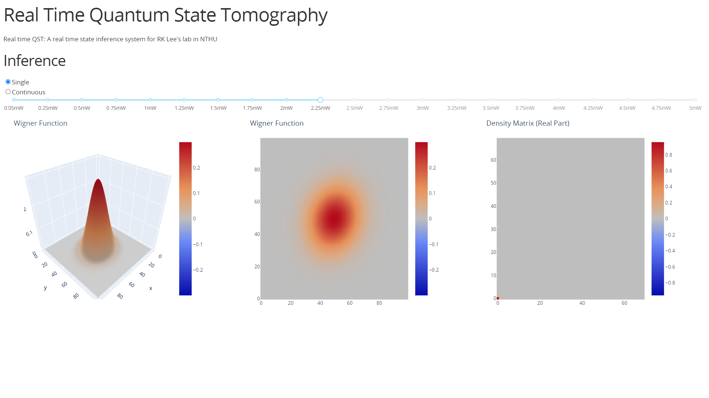
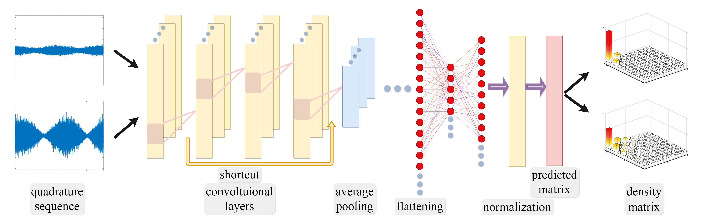

# SqState

Squeezed state solver for quantum optics.

## About

In this real time squeezed state tomography system, we introduced a machine learning model that illustrates fast and precise squeezed state tomography for continuous variables, through the experimentally measured data generated from the balanced homodyne detectors.

## Model

The data of quadrature sequence obtained by quantum homodyne tomography are fed to the model with its architecture constructed by residual blocks. Then, after flattening, the predicted arguments represents the squeezed state in concept.

<pre><code>
Chain(
  BatchNorm(1),                         # 2 parameters, plus 2
  Conv((31,), 1 => 8, pad=15),          # 256 parameters
  BatchNorm(8, relu),                   # 16 parameters, plus 16
  Chain(
    Parallel(
      +,
      Chain(
        Conv((1,), 8 => 4),             # 36 parameters
        BatchNorm(4, relu),             # 8 parameters, plus 8
        Conv((15,), 4 => 4, pad=7),     # 244 parameters
        BatchNorm(4, relu),             # 8 parameters, plus 8
        Conv((7,), 4 => 16, pad=3),     # 464 parameters
        BatchNorm(16),                  # 32 parameters, plus 32
      ),
      Chain(
        Conv((1,), 8 => 16),            # 144 parameters
        BatchNorm(16),                  # 32 parameters, plus 32
      ),
    ),
    BatchNorm(16, relu),                # 32 parameters, plus 32
  ),
  Chain(
    Parallel(
      +,
      Chain(
        Conv((1,), 16 => 8),            # 136 parameters
        BatchNorm(8, relu),             # 16 parameters, plus 16
        Conv((15,), 8 => 8, pad=7),     # 968 parameters
        BatchNorm(8, relu),             # 16 parameters, plus 16
        Conv((7,), 8 => 32, pad=3),     # 1_824 parameters
        BatchNorm(32),                  # 64 parameters, plus 64
      ),
      Chain(
        Conv((1,), 16 => 32),           # 544 parameters
        BatchNorm(32),                  # 64 parameters, plus 64
      ),
    ),
    BatchNorm(32, relu),                # 64 parameters, plus 64
  ),
  Chain(
    Parallel(
      +,
      Chain(
        Conv((1,), 32 => 16),           # 528 parameters
        BatchNorm(16, relu),            # 32 parameters, plus 32
        Conv((15,), 16 => 16, pad=7),   # 3_856 parameters
        BatchNorm(16, relu),            # 32 parameters, plus 32
        Conv((7,), 16 => 64, pad=3),    # 7_232 parameters
        BatchNorm(64),                  # 128 parameters, plus 128
      ),
      Chain(
        Conv((1,), 32 => 64),           # 2_112 parameters
        BatchNorm(64),                  # 128 parameters, plus 128
      ),
    ),
    MeanPool((2,)),
    BatchNorm(64, relu),                # 128 parameters, plus 128
  ),
  Chain(
    Parallel(
      +,
      Chain(
        Conv((1,), 64 => 32),           # 2_080 parameters
        BatchNorm(32, relu),            # 64 parameters, plus 64
        Conv((15,), 32 => 32, pad=7),   # 15_392 parameters
        BatchNorm(32, relu),            # 64 parameters, plus 64
        Conv((7,), 32 => 128, pad=3),   # 28_800 parameters
        BatchNorm(128),                 # 256 parameters, plus 256
      ),
      Chain(
        Conv((1,), 64 => 128),          # 8_320 parameters
        BatchNorm(128),                 # 256 parameters, plus 256
      ),
    ),
    MeanPool((2,)),
    BatchNorm(128, relu),               # 256 parameters, plus 256
  ),
  Chain(
    Parallel(
      +,
      Chain(
        Conv((1,), 128 => 32),          # 4_128 parameters
        BatchNorm(32, relu),            # 64 parameters, plus 64
        Conv((15,), 32 => 32, pad=7),   # 15_392 parameters
        BatchNorm(32, relu),            # 64 parameters, plus 64
        Conv((7,), 32 => 64, pad=3),    # 14_400 parameters
        BatchNorm(64),                  # 128 parameters, plus 128
      ),
      Chain(
        Conv((1,), 128 => 64),          # 8_256 parameters
        BatchNorm(64),                  # 128 parameters, plus 128
      ),
    ),
    MeanPool((2,)),
    BatchNorm(64, relu),                # 128 parameters, plus 128
  ),
  Chain(
    Parallel(
      +,
      Chain(
        Conv((1,), 64 => 16),           # 1_040 parameters
        BatchNorm(16, relu),            # 32 parameters, plus 32
        Conv((15,), 16 => 16, pad=7),   # 3_856 parameters
        BatchNorm(16, relu),            # 32 parameters, plus 32
        Conv((7,), 16 => 32, pad=3),    # 3_616 parameters
        BatchNorm(32),                  # 64 parameters, plus 64
      ),
      Chain(
        Conv((1,), 64 => 32),           # 2_080 parameters
        BatchNorm(32),                  # 64 parameters, plus 64
      ),
    ),
    MeanPool((2,)),
    BatchNorm(32, relu),                # 64 parameters, plus 64
  ),
  Chain(
    Parallel(
      +,
      Chain(
        Conv((1,), 32 => 8),            # 264 parameters
        BatchNorm(8, relu),             # 16 parameters, plus 16
        Conv((15,), 8 => 8, pad=7),     # 968 parameters
        BatchNorm(8, relu),             # 16 parameters, plus 16
        Conv((7,), 8 => 16, pad=3),     # 912 parameters
        BatchNorm(16),                  # 32 parameters, plus 32
      ),
      Chain(
        Conv((1,), 32 => 16),           # 528 parameters
        BatchNorm(16),                  # 32 parameters, plus 32
      ),
    ),
    MeanPool((2,)),
    BatchNorm(16, relu),                # 32 parameters, plus 32
  ),
  Chain(
    Parallel(
      +,
      Chain(
        Conv((1,), 16 => 4),            # 68 parameters
        BatchNorm(4, relu),             # 8 parameters, plus 8
        Conv((15,), 4 => 4, pad=7),     # 244 parameters
        BatchNorm(4, relu),             # 8 parameters, plus 8
        Conv((7,), 4 => 8, pad=3),      # 232 parameters
        BatchNorm(8),                   # 16 parameters, plus 16
      ),
      Chain(
        Conv((1,), 16 => 8),            # 136 parameters
        BatchNorm(8),                   # 16 parameters, plus 16
      ),
    ),
    MeanPool((2,)),
    BatchNorm(8, relu),                 # 16 parameters, plus 16
  ),
  Flux.flatten,
  Dense(512, 64, relu),                 # 32_832 parameters
  Dense(64, 16, relu),                  # 1_040 parameters
  Dense(16, 3, relu),                   # 51 parameters
)         # Total: 156 trainable arrays, 165_637 parameters,
          # plus 84 non-trainable, 2_658 parameters, summarysize 681.855 KiB.
</code></pre>

